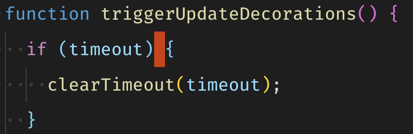

# Non-breaking space highlighter

This extension highlights unicode characters that might be hard to spot.

Non-breaking space (alt+space) on mac, is easy to enter by mistake and can be hard to spot and lead to unnecessary downtime. This extension aims to help with that by highlighting non-breaking space and other odd unicode charaters. This extension was created by a fork of [nbsp-vscode](https://marketplace.visualstudio.com/items?itemName=possan.nbsp-vscode) but the visualizing of trailing space has been removed. If you also want visualization of trailing whitespace I recommend that you check it out.

